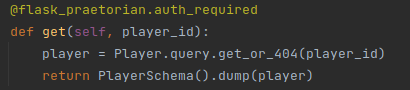
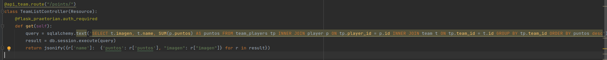

# REST API CAMPEONATO DE CLICKS
Este proyecto consiste en una API REST en la cual podremos introducir los puntos de un jugador mediante
la parte front-end además de hacer una consulta de la clasificación ya sea individualmente, en equipo,
por localidad, region o país. También tendremos a disposición un CRUD para todas las entidades del programa.

## Parte Back-end

### Despliegue de la api
**Clonamos el repositorio |**
**Instalar los requisitos que se encuentran en *"requirements.txt"* con pip**

Para poner en funcionamiento la API abrimos el proyecto con algún IDE (En mi caso uso Pycharm)
y configuramos el entorno virtual donde se ejecutará el proyecto.

### Autenticación
En cuanto a la autenticación tenemos dos métodos en el proyecto:

    1. Vía formulario
       Con este método simplemente obtenemos el usuario y contraseña introducidos mediante un json y comprobamos
       mediante praetorian la autenticación y devolvemos un jwt

    2. Vía Github
       Este método tendremos que realizarlo mediante el navegador ya que nos llevará a la página de
       acceso de github y, al comprobar el usuario devuelve un jwt.

### CRUD de las entidades
En cuanto al crud nos encontraremos las tipicas funciones:

    1. Obtener todos los valores de la tabla:
       
 

    2. Obtener todos los valores de una fila en la tabla:

    3. Crear una nueva fila en la tabla:

    4. Modificar una fila de la tabla:

    5. Eliminar una fila de la tabla:

Además del CRUD tenemos una serie de funciones para consultar las clasificaciones:

    1. Obtener los puntos de todos los equipos (las consultas se van anidando en cuanto vamos consultando regiones o localidades, etc...)

    2. Obtener puntos de un equipo (las consultas se van anidando en las otras entidades, como hemos mencionado anteriormente)

También tenemos un método único para subir imágenes a los equipos y jugadores (Las imágenes se guardarán en la carpeta /static/imagenes/):

## Parte Front-end

### Acceder al login
Si iniciamos la API como hemos mencionado anteriormente y accedemos a la dirección *"http://127.0.0.1:5000/static/demos-clicker/index.html"*
accederemos al formulario de login:

Una vez dentro tendremos acceso al juego, se nos irán mostrando diferentes cuadrados en los que tendremos que hacer click para sumar puntos a nuestro
jugador, también tendremos en el header la opción de ver las clasificaciones y hacer logout.

Si entramos en la clasificación podremos visualizar los puntos de jugadores, equipos, etc... ordenados por su puesto en la clasificación

### Documentación API
Si entramos *"http://127.0.0.1:5000/api/docs"* tendremos acceso a una documentación automatizada de todos los puntos de entreda de la API REST:

## Test unitarios
El proyecto dispone de un conjunto de test unitarios para comprobar el correcto funcionamiento de los puntos de entrada
de la API REST, estos test se encuentan en la carpeta *"/tests/"* y tendremos un archivo .py para cada entidad del modelo y sus funciones.
